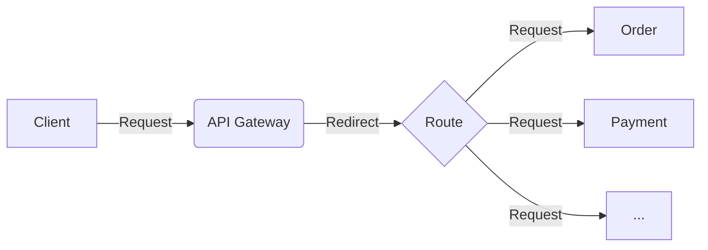

# microservices-node

## Node Microservices



- Order
```
index.js (Running on PORT 8081)

http://localhost:8081/order-list
```
- Payment
```
index.js (Running on PORT 8082)

http://localhost:8082/payment-list
```
- API-Gateway
```
index.js (Running on Port 8080)

http://localhost:8080/order/order-list       --> http://localhost:8081/order-list
http://localhost:8080/payment/payment-list   --> http://localhost:8082/payment-list
```
